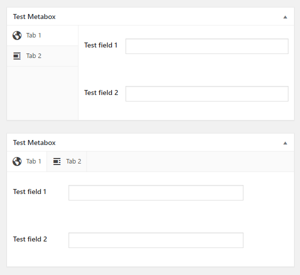

# CMB2 Tabs

Tabs for [CMB2](https://github.com/WebDevStudios/CMB2).



## How it works?

This plugin adds new parameters to CMB2 boxes:

* vertical_tabs (bool)
* tabs (array)

## Example
```php
add_action( 'cmb2_admin_init', 'cmb2_sample_metabox' );
function cmb2_sample_metabox() {

	$prefix = 'your_prefix_demo_';

	$cmb_demo = new_cmb2_box( array(
		'id'            => $prefix . 'metabox',
		'title'         => __( 'Test Metabox', 'cmb2' ),
		'object_types'  => array( 'page', 'post' ), // Post type
		'vertical_tabs' => true, // Set vertical tabs, default false
        'tabs' => array(
            array(
                'id'    => 'tab-1',
                'icon' => 'dashicons-admin-site',
                'title' => 'Tab 1',
                'fields' => array(
                    $prefix . '_field_1',
                    $prefix . '_field_2',
                ),
            ),
            array(
                'id'    => 'tab-2',
                'icon' => 'dashicons-align-left',
                'title' => 'Tab 2',
                'fields' => array(
                    $prefix . '_field_3',
                    $prefix . '_field_4',
                ),
            ),
        )
	) );

	$cmb_demo->add_field( array(
		'name'          => __( 'Test field 1', 'cmb2' ),
		'id'            => $prefix . '_field_1',
		'type'          => 'text',
	) );

	$cmb_demo->add_field( array(
        'name'          => __( 'Test field 2', 'cmb2' ),
        'id'            => $prefix . '_field_2',
        'type'          => 'text',
    ) );

    $cmb_demo->add_field( array(
        'name'          => __( 'Test field 3', 'cmb2' ),
        'id'            => $prefix . '_field_3',
        'type'          => 'text',
    ) );

    $cmb_demo->add_field( array(
        'name'          => __( 'Test field 4', 'cmb2' ),
        'id'            => $prefix . '_field_4',
        'type'          => 'text',
    ) );

}
```

## Changelog

### 1.0.4

* Ensure that all tab parameters has been passed correctly.

### 1.0.3

* Added support for dark mode.
* Fixed tab display on widgets screen.

### 1.0.2

* Fixed add group row selector.

### 1.0.1

* Added cmb2-tab-ignore utility.

### 1.0.0

* Initial commit.